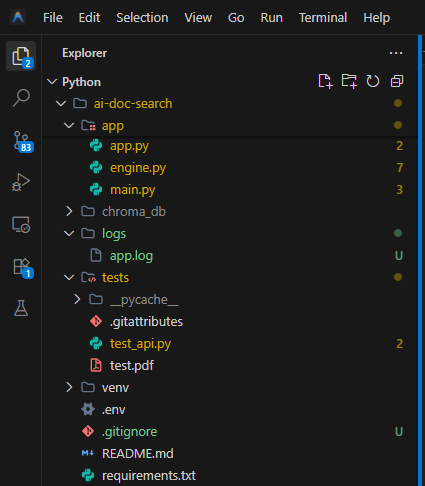
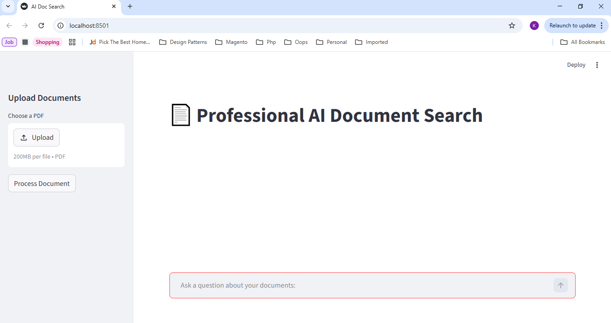
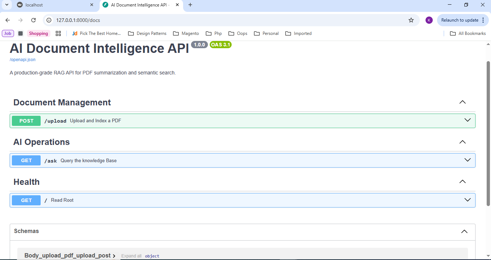

# AI-Powered Document Summarizer & Search Engine

This project implements a Retrieval-Augmented Generation (RAG) system using LangChain, ChromaDB, and Ollama. It allows users to upload PDF documents and ask natural language questions about their content.

## Features
- **PDF Processing**: Extracts text from uploaded PDF files.
- **Vector Database**: Uses ChromaDB (local, file-based) to store and retrieve semantic embeddings.
- **Ollama Integration**: Utilizes `nomic-embed-text` for embeddings and `phi3` for text generation.
- **FastAPI Backend**: A robust REST API for document ingestion and querying.
- **Streamlit Frontend**: A clean UI for testing the application locally.
- **Production Ready**:
    - Proper logging (Stream + File).
    - Unit Testing infrastructure.
    - Dockerfile for containerization.

## Installation

### Prerequisites
- Python 3.9+
- Docker (for running Ollama)

### 1. Setup Environment
-bash
python -m venv venv
# Windows
venv\Scripts\activate

# macOS/Linux
source venv/bin/activate

### 2. Install Dependencies
-bash
pip install -r requirements.txt

### 3. Start Docker
Ensure Docker is running and pull the required models:
-bash
docker run -d -v ollama:/root/.ollama -p 11434:11434 --name ollama ollama/ollama

Pull the specific models needed for the app:
-bash
docker exec -it ollama ollama pull nomic-embed-text
docker exec -it ollama ollama pull phi3

## Running the Application

### Local Development (Streamlit)
-bash
uvicorn app.main:app --reload & streamlit run app/app.py

### Docker Deployment
1. **Build**: `docker build -t ai-doc-search .`
2. **Run**: `docker run -p 8000:8000 -p 8501:8501 -v ollama:/root/.ollama ai-doc-search`

## Testing
Run the automated tests:
-bash
pytest tests/

## Folder Structure
- 'app/': Contains the core Python logic (FastAPI app, Engine, Schemas).
- 'tests/': Unit tests and fixtures.
- 'logs/': Generated log files.
- 'chroma_db/': Generated vector database (excluded from git).

Screenshots:

